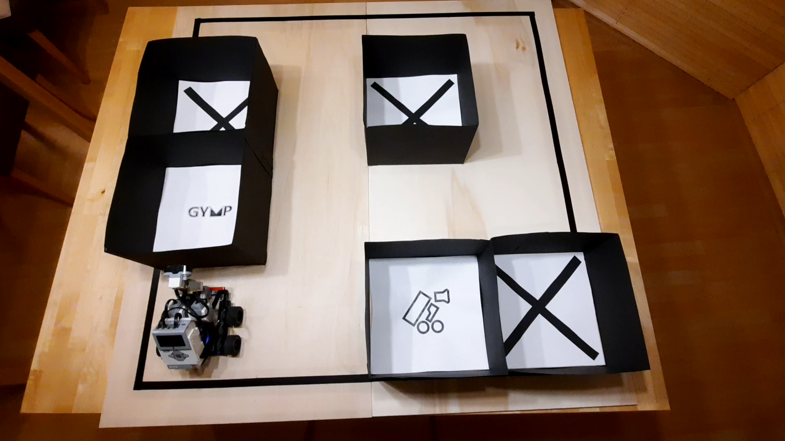
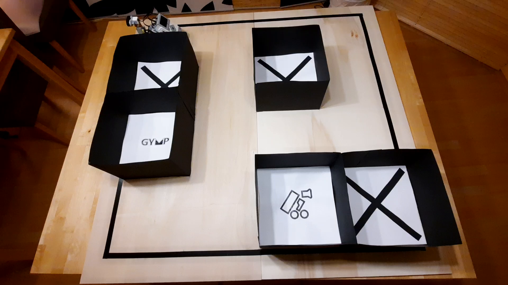

# Pathfinder

A robot who explores a mazes and navigates with in it to a chosen point

## Overview

Set in a 4x4 maze, the robots explores the maze by its own and their by creating a map, thats written to disk. (-> [Video of Explorer stage](https://mintcalc.com/explorer.mp4))

Given a map and current position the robot finds the shortest path to a given goal and moves to it
(-> [Video of Navigation stage](https://mintcalc.com/finder.mp4))

## System
There are two components in this system: The Client (a Laptop or Tower Computer) and the EV3 robot it self. 

The EV3 robot is controlled via protocol based on tcp. The robots listens for incoming client connection on port 1337. (This is specified [here](./ProtocolSpec.md)). The Script that runs on the EV3 can be found in the [robot](./src/robot) folder. The Robot is a lego Mindstorms EV3 running [EV3Dev](https://www.ev3dev.org/) and is connected via WIFI to the Local Network.

The pathfinding and control on the other side is done on the client due to the hardware constrains of the EV3. The code for it can be found [here](./src/client/). Dijkstra's algorithm is used to find the shortest path.

## Project Structure
- final_presetnation: Contains the final [PowerPoint Presentation](final_presentation/Präsentation.pptx)
- src: Contains all the relevant source files
  - client: All programs run on the client (pathfinding, command and control)
    - toolkit: Contains some util functions to display the current state of the maze nicely
    - maps: Contains all maps created by the explore program
    - explorer_client.py: Launches the Explore Stage of the maze
    - finder_client.py: Launches the Navigation Stage, given a map, start and goal position
    - simple_client.py: Test Client, that gives access to the commands defined by the protocol via a command line interface
  - robot: Contains Server Script run on the EV3 it self
